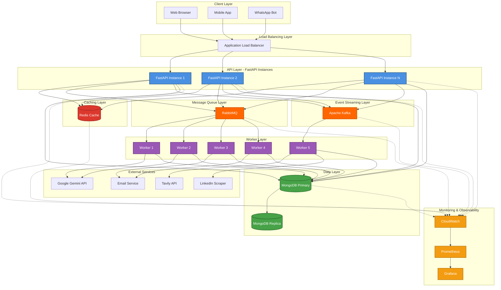

# System Architecture - Project Morpheus

## Scaled Architecture Diagram



## Component Details

### 1. Load Balancing Layer

- **Application Load Balancer**: Distributes traffic across multiple FastAPI instances
- Health checks ensure only healthy instances receive traffic
- SSL termination for HTTPS

### 2. API Layer

- **Multiple FastAPI Instances**: Horizontally scalable
- Each instance handles all routes but load is distributed
- Stateless design for easy scaling

### 3. Caching Layer (Redis)

- **User Profiles**: Fast access to frequently requested data
- **Job Listings**: Cached with TTL to reduce DB load
- **Career Recommendations**: Cache by user_id + skills hash
- **Session Storage**: JWT tokens and session data
- **Rate Limiting**: Track API call counts per user

### 4. Message Queue (RabbitMQ)

- **resume_generation**: Heavy AI processing tasks
- **presentation_generation**: Async PPT creation
- **portfolio_deploy**: Deployment tasks
- **interview_sessions**: Long-running interview processes
- **email_queue**: Bulk email sending
- Dead Letter Queues for failed tasks

### 5. Event Streaming (Kafka)

- **job-scraping**: Distributed job scraping events
- **career-recommendations**: Recommendation generation events
- **user-events**: User activity analytics
- **email-events**: Email tracking and analytics

### 6. Worker Layer

- **Stateless Workers**: Process tasks from queues
- Auto-scaling based on queue depth
- Retry logic for failed tasks

### 7. Data Layer

- **MongoDB Primary**: Write operations
- **MongoDB Replicas**: Read operations for better performance
- Connection pooling for efficient resource usage

### 8. Monitoring & Observability

- **CloudWatch**: Metrics, logs, and alarms
- **Prometheus**: Advanced metrics collection
- **Grafana**: Visual dashboards and alerting

## Data Flow Examples

### Career Recommendation Request

```
User → LB → API Instance → Redis (check cache)
                                    ↓ (cache miss)
                              RabbitMQ → Worker → Gemini API
                                    ↓
                              Redis (store result) → MongoDB (persist)
                                    ↓
                              User (response)
```

### Job Scraping Flow

```
Scheduler → Kafka Producer → Kafka Topic (job-scraping)
                                    ↓
                              Multiple Workers consume
                                    ↓
                              Tavily/LinkedIn APIs
                                    ↓
                              MongoDB (store jobs)
                                    ↓
                              Redis (cache job listings)
```

### Resume Generation Flow

```
User Request → API → RabbitMQ (resume_generation queue)
                                    ↓
                              Worker picks task
                                    ↓
                              Gemini API (AI processing)
                                    ↓
                              MongoDB (save resume)
                                    ↓
                              Redis (cache for quick access)
                                    ↓
                              User (download PDF)
```

## Scaling Strategy

1. **Horizontal Scaling**: Add more FastAPI instances behind load balancer
2. **Auto-scaling**: Scale workers based on queue depth
3. **Database Scaling**: Read replicas for MongoDB
4. **Cache Scaling**: Redis Cluster for high availability
5. **Queue Scaling**: Kafka partitions for parallel processing
